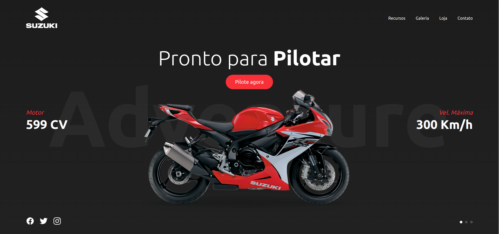
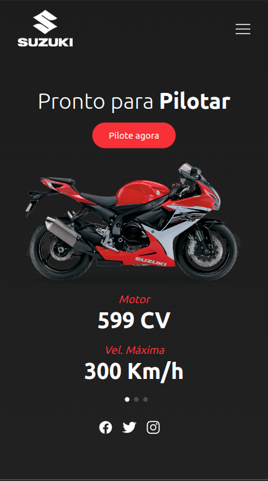

# Suzuki Bike Landing Page
Acesse: <a href="https://responsive-websites-design.vercel.app/">Suzuki</a>

    
    

### Ajustes e melhorias

O projeto está concluído.

- [x] Desktop
- [x] Mobile

## 👨🏻‍💻 Desenvolvedor

<table>
  <tr>
    <td align="center">
      

         
        
          <b>Ítalo Henrique</b>
        
      

    </td>
  </tr>
</table>
